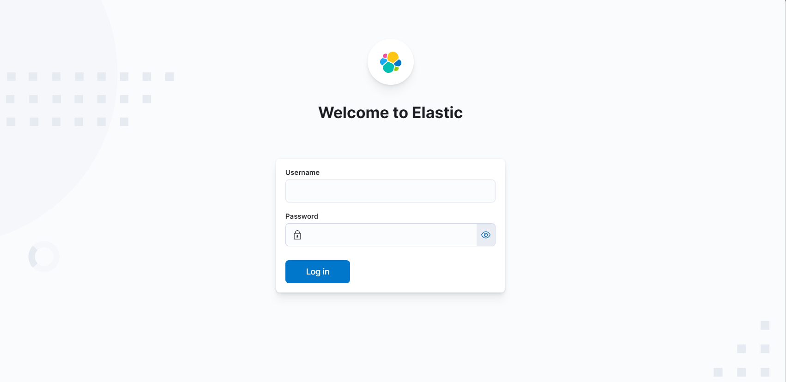
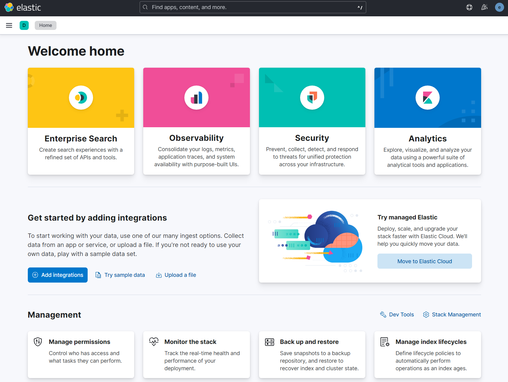

# Elastic Stack in Docker

Elastic Stack with Docker Compose

## Overview

This guide will help you to deploy and run Elastic Stack with Docker on your local machine.

## Requirements

- OS: this guide was made in a Windows 11 OS, to run on Linux or macOS some adjustements may be necessary.
- [WSL](https://learn.microsoft.com/en-us/windows/wsl/install)
- [Docker Desktop with WSl](https://docs.docker.com/desktop/wsl/)

## Instruction

1. Clone this repo
2. Create an .env file inside the repo root folder.
3. Set the environemtn variables below inside the .env file.
   ```bash
    # Project namespace (defaults to the current folder name if not set)
    #COMPOSE_PROJECT_NAME=myproject
    # Password for the 'elastic' user (at least 6 characters)
    ELASTIC_PASSWORD=changeme
    # Password for the 'kibana_system' user (at least 6 characters)
    KIBANA_PASSWORD=changeme
    # Version of Elastic products
    STACK_VERSION=8.7.1
    # Set the cluster name
    CLUSTER_NAME=docker-cluster
    # Set to 'basic' or 'trial' to automatically start the 30-day trial
    LICENSE=basic
    #LICENSE=trial
    # Port to expose Elasticsearch HTTP API to the host
    ES_PORT=9200
    # Port to expose Kibana to the host
    KIBANA_PORT=5601
    # Increase or decrease based on the available host memory (in bytes)
    ES_MEM_LIMIT=1073741824
    KB_MEM_LIMIT=1073741824
    LS_MEM_LIMIT=1073741824
    # SAMPLE Predefined Key only to be used in POC environments
    ENCRYPTION_KEY=c34d38b3a14956121ff2170e5030b471551370178f43e5626eec58b04a30fae2
   ```
4. Set vm.max_map_count to at least 262144. Check this link to see how to change it in your OS: https://www.elastic.co/guide/en/elasticsearch/reference/current/docker.html#_set_vm_max_map_count_to_at_least_262144
5. **IMPORTANT**: Make the files filebeat.yml, logstash.yml and metricbeat.yml read only.
6. The stack will create a data folder inside the repo root folder. This will server as an entrypoint for all containers data that may persist. Check docker-compose.yml and change the volumes with data folder to a differente location, if you want.
7. Run docker-compose
   ```bash
    docker-compose up -d --force-recreate
   ```
8. Access Elastic Stack through https://localhost:5601
9. Login with the user and password provided in the .env file (i.e. username: elastic and password: changeme)
   
10. Voilà. You can now use Elastic Stack.
    

## References

- [Install Elasticsearch with Docker](https://www.elastic.co/guide/en/elasticsearch/reference/current/docker.html)
- [Getting started with the Elastic Stack and Docker Compose](https://www.elastic.co/pt/blog/getting-started-with-the-elastic-stack-and-docker-compose)
